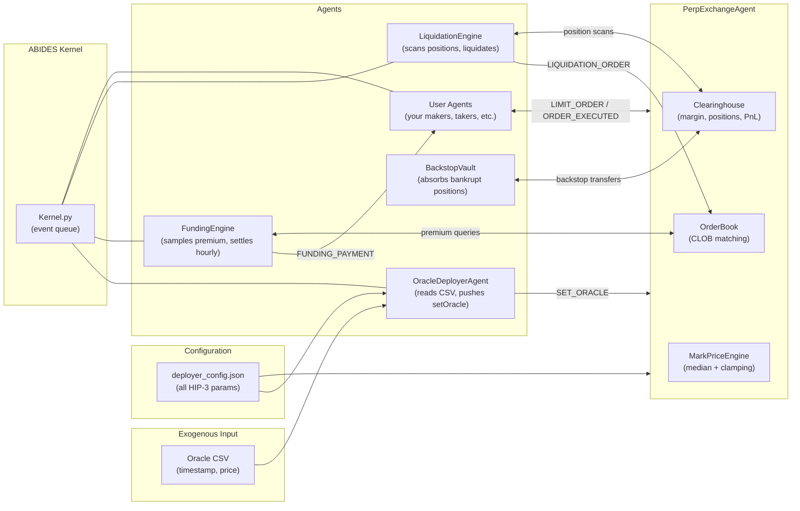
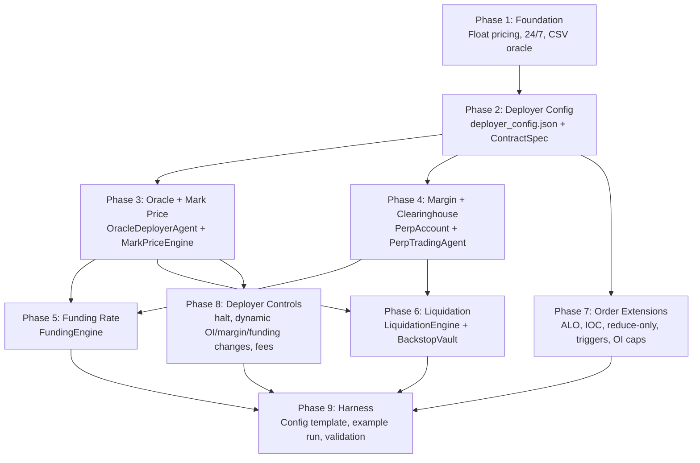

# HIP-3 Hyperliquid Perpetual Futures on ABIDES: Design Plan

## Design Decisions (from clarifications)

- **All HIP-3 deployer actions** are stored in a dedicated config file (`deployer_config.json`) — not hardcoded. Every parameter from `registerAsset`, `setOracle`, `setFundingMultipliers`, `setMarginTableIds`, `setOpenInterestCaps`, margin modes, and fee schedule is configurable there.
- **Agent strategies are user-defined.** We build a clean `PerpTradingAgent` base class with the margin/funding/liquidation plumbing. Users subclass it for their own makers, informed traders, or anything else. No opinionated background agent population is shipped — just the infrastructure.
- **Oracle input**: A CSV file with two columns (timestamp, price) at sub-second resolution. A new `CsvOracle` adapter loads this and provides `observePrice(symbol, time)` via binary search on sorted timestamps.
- **General research platform**: All mechanics (microstructure, funding, liquidation) implemented at full fidelity. No shortcuts that would prevent studying any particular dynamic.
- **Single asset initially**, designed so multi-asset (separate books sharing margin on the same HIP-3 DEX) can be added later without architectural changes.

---

## Why HIP-3 Is a Better Fit Than Standard HL Perps

HIP-3 (builder-deployed perpetuals) is a significantly cleaner mapping than standard Hyperliquid perps for this simulation, for one critical reason: **the deployer controls the oracle and mark price inputs**.

On standard HL perps, the oracle is a validator-computed weighted median of CEX spot prices, and the mark price is a median of (oracle + EMA, local book, external CEX perp mids). This requires external price feeds that don't exist in our simulation.

On HIP-3, the deployer calls `setOracle` every ~3 seconds, pushing three values:
- **`oraclePxs`**: the oracle/index price (our exogenous CSV input)
- **`markPxs`**: 0, 1, or 2 external mark price inputs (deployer-chosen)
- **`externalPerpPxs`**: external perp prices for safety clamping

The protocol then computes: **`mark_price = median(deployer_markPxs + local_mark_price)`** where `local_mark_price = median(best_bid, best_ask, last_trade)`.

For a perp on an untradeable underlying with no external references, the deployer supplies 0 external mark price inputs. Mark price becomes **just the local book mark price** (median of best bid, best ask, last trade), with the oracle used only for funding. This is precisely the HIP-3 design intent for novel assets.

---

## Architecture Overview



---

## What ABIDES Gives Us For Free

- **Discrete-event kernel** ([Kernel.py](Kernel.py)): Priority-queue message delivery with nanosecond timestamps, pairwise latency, computation delays.
- **CLOB matching** ([util/OrderBook.py](util/OrderBook.py)): Price-time priority limit order book with partial fills. Core matching logic is reusable.
- **Agent framework** ([agent/TradingAgent.py](agent/TradingAgent.py)): Message-based agent lifecycle with wakeup scheduling.
- **Latency model** ([model/LatencyModel.py](model/LatencyModel.py)): Pairwise agent-to-exchange latency.
- **Market data subscriptions**: `MARKET_DATA` push already exists.

---

## What Must Be Built

### 1. CSV Oracle Adapter

New `util/oracle/CsvOracle.py`:

- Loads a CSV with columns `timestamp` (Unix epoch float or ISO datetime) and `price` (float).
- Sub-second resolution means potentially millions of rows. Use numpy array of timestamps + prices, with `np.searchsorted` for O(log n) lookups.
- Implements the existing oracle interface: `getDailyOpenPrice(symbol, mkt_open)` returns price at or just before `mkt_open`; `observePrice(symbol, currentTime, sigma_n=0, random_state=None)` returns interpolated or last-known price at `currentTime`. With `sigma_n > 0`, adds Gaussian noise (for agents that observe the oracle noisily).
- Handles the mapping from ABIDES `pd.Timestamp` to the CSV's timestamp format.

This replaces the existing oracles (`SparseMeanRevertingOracle`, etc.) as the data source for the `OracleDeployerAgent`. The existing oracles remain available for synthetic simulations.

### 2. HIP-3 Deployer Configuration File

New `deployer_config.json` (or YAML) that captures every HIP-3 deployer action as static config:

```json
{
  "dex": {
    "name": "MY_DEX",
    "collateral_token": "USDC",
    "fee_schedule": {
      "maker_fee_bps": 2.0,
      "taker_fee_bps": 7.0,
      "deployer_share": 0.5,
      "protocol_share": 0.5
    }
  },
  "assets": [
    {
      "coin": "ASSET-USD",
      "sz_decimals": 2,
      "initial_oracle_px": 100.0,
      "oracle_csv": "path/to/oracle.csv",
      "margin_mode": "normal",
      "margin_table": {
        "tiers": [
          {"lower_bound_notional": 0, "max_leverage": 20},
          {"lower_bound_notional": 3000000, "max_leverage": 10}
        ]
      },
      "funding_impact_notional": 6000.0,
      "funding_multiplier": 1.0,
      "oi_cap_notional": 50000000,
      "oi_cap_size": 1000000000
    }
  ],
  "oracle_update_interval_s": 3.0,
  "deployer_mark_px_mode": "none",
  "external_perp_px_mode": "ema_of_mark"
}
```

Key config fields mapped to HIP-3 deployer actions:
- `registerAsset` -> `assets[*]` (coin, szDecimals, oraclePx, marginTableId, onlyIsolated)
- `setOracle` -> `oracle_update_interval_s`, `deployer_mark_px_mode` ("none", "oracle_based", or "custom"), `external_perp_px_mode`
- `setFundingMultipliers` -> `assets[*].funding_multiplier`
- `setMarginTableIds` / `insertMarginTable` -> `assets[*].margin_table`
- `setOpenInterestCaps` -> `assets[*].oi_cap_notional`, `oi_cap_size`
- `haltTrading` -> runtime action (deployer agent can be configured to halt at a specific time or condition)
- `setFeeRecipient` -> `dex.fee_schedule`

The `OracleDeployerAgent` and `PerpExchangeAgent` both read this config at initialization.

### 3. HIP-3 Oracle and Mark Price Engine

**`OracleDeployerAgent`** — a new agent acting as the HIP-3 deployer:

- On each wakeup (every `oracle_update_interval_s` simulated seconds), reads the current oracle price from `CsvOracle`
- Sends `SET_ORACLE` message to `PerpExchangeAgent` containing:
  - `oracle_pxs`: `{symbol: price}` from CSV
  - `mark_pxs`: 0, 1, or 2 external mark prices (based on `deployer_mark_px_mode` in config)
  - `external_perp_pxs`: EMA of recent mark prices (when mode is `ema_of_mark`) or omitted

**`MarkPriceEngine`** (component of `PerpExchangeAgent`):

- On receiving `SET_ORACLE`:
  1. Compute `local_mark = median(best_bid, best_ask, last_trade)` from the order book
  2. `all_inputs = deployer_mark_pxs + [local_mark]`
  3. `raw_mark = median(all_inputs)`
  4. Apply clamping: `clamped_mark = clamp(raw_mark, prev_mark * 0.99, prev_mark * 1.01)`
  5. Apply daily cap: `clamped_mark = min(clamped_mark, start_of_day_mark * 10)`
  6. Check OI constraint: if `current_oi * clamped_mark > 10 * oi_cap`, reject update
  7. Store `mark_price = clamped_mark`
- Staleness: if no `SET_ORACLE` received for 10 simulated seconds, auto-update mark to local book mark price
- Mark price is used for: margining, liquidations, trigger orders, unrealized PnL

**Fidelity**: Exact replication of HIP-3's `setOracle` API and mark price derivation.

### 4. Margin and Clearinghouse

**`Clearinghouse`** — new component on `PerpExchangeAgent` (or standalone class):

Manages `PerpAccount` per agent:
- `balance`: float collateral
- `positions`: dict `{symbol: Position(size, entry_price, leverage, margin_mode, isolated_margin)}`

**Margin modes** (per-asset, from deployer config `margin_mode`):
- `normal`: cross or isolated per-position choice by the agent
- `noCross`: isolated only, margin removal allowed
- `strictIsolated`: isolated only, margin removed proportionally on close

**Margin math** (from HL docs, using deployer-configured `MarginTable`):
- `initial_margin = abs(size) * mark_price / leverage`
- `maintenance_margin = abs(size) * mark_price * mm_rate(tier) - mm_deduction(tier)`
- `mm_rate(tier_n) = (1 / max_leverage_at_tier_n) / 2`
- `mm_deduction(tier_0) = 0`
- `mm_deduction(tier_n) = mm_deduction(tier_{n-1}) + lower_bound(tier_n) * (mm_rate(tier_n) - mm_rate(tier_{n-1}))`
- `unrealized_pnl = size * (mark_price - entry_price)` (linear contract)

**`PerpTradingAgent`** base class (replaces/extends `TradingAgent`):

- Holds a `PerpAccount` instead of `holdings` dict
- `orderExecuted` rework:
  1. If opening/increasing: check initial margin, deduct from balance (cross) or allocate isolated margin, compute weighted-average entry price
  2. If reducing/closing: realize PnL into balance, release margin
  3. Apply trading fees
- `markToMarket` uses mark price from exchange, not last trade
- Exposes position/margin state for subclass strategies to read
- Does **not** define `getWakeFrequency` or any trading logic — subclasses (user strategies) own that entirely

**Leverage check**: Only on open/increase. After that, agent manages risk (close, add margin, deposit). Matching HL exactly.

### 5. Funding Rate

**Formula** (identical to HL, with HIP-3 `fundingMultiplier`):

```
F = (avg(premium_samples_this_hour) + clamp(0.0001 - avg(premium_samples_this_hour), -0.0005, 0.0005)) * funding_multiplier
premium = impact_price_diff / oracle_price
impact_price_diff = max(impact_bid_px - oracle_px, 0) - max(oracle_px - impact_ask_px, 0)
```

Where `impact_bid_px` / `impact_ask_px` = average fill price for `funding_impact_notional` on each book side.

**Implementation**: `FundingEngine` (agent or exchange component):

- Wakes every 5 simulated seconds: reads current oracle price and order book depth, computes `premium` sample, appends to rolling buffer
- Wakes every hour (00:00, 01:00, ... UTC): computes average premium over the hour, applies formula, computes 1/8 of 8-hour rate
- For each agent with open positions: `funding_payment = position_size * oracle_price * hourly_rate`
  - Positive rate: longs pay shorts
  - Negative rate: shorts pay longs
- Sends `FUNDING_PAYMENT` messages to agents; agents update their `PerpAccount.balance`
- Funding is capped at 4% per hour
- `funding_multiplier` read from deployer config per asset

**Fidelity**: Exact replication.

### 6. Liquidation Engine

**`LiquidationEngine`** (agent or exchange component):

- Triggered on every mark price update (i.e. on each `SET_ORACLE` processing)
- Scans all `PerpAccount`s for `account_value < maintenance_margin`
- **Market-order liquidation**: sends liquidation market order to book
  - Full position size if notional <= 100k USDC
  - 20% of position if notional > 100k USDC; 30-second cooldown, then full position on next check
  - Liquidation orders carry `is_liquidation=True` flag — bypass margin checks, don't create new position for liquidator (handled separately)
- **Backstop**: if `account_value < (2/3) * maintenance_margin` after book liquidation attempt:
  - Cross: transfer all cross positions + remaining cross margin to `BackstopVault` agent
  - Isolated: transfer that position + isolated margin to `BackstopVault`
  - Liquidated agent ends at zero equity (cross) or loses that isolated position
- `BackstopVault` agent: accepts transferred positions, can close them over time or hold. Tracks PnL for analysis.

**Fidelity**: High. Backstop is simplified vs full HLP but economically equivalent for the liquidated trader and the order book.

### 7. Order Type Extensions

Changes to [util/order/LimitOrder.py](util/order/LimitOrder.py) — new fields:
- `time_in_force`: enum `GTC` (default), `IOC`, `ALO` (post-only)
- `reduce_only`: bool (default False)
- `trigger_price`: optional float + `trigger_type` enum (`STOP_MARKET`, `STOP_LIMIT`, `TAKE_MARKET`, `TAKE_LIMIT`) for conditional orders

Changes to [util/OrderBook.py](util/OrderBook.py):
- `handleLimitOrder`: before match loop, if `ALO` and would match, send `ORDER_REJECTED` instead
- `handleLimitOrder`: after match loop, if `IOC` and qty remaining, cancel remainder
- `executeOrder`: self-trade prevention — if `incoming.agent_id == resting.agent_id`, cancel resting, skip match

Changes to `PerpExchangeAgent`:
- `trigger_orders` dict: on each mark price update, check all trigger orders, convert triggered ones to regular orders
- `reduce_only` enforcement: on fill, if resulting position would flip sides, clip fill qty to current position size
- **OI cap enforcement**: on each fill, compute new total OI; reject the order if it would breach the deployer-configured cap (both notional and size)

### 8. HIP-3 Deployer Runtime Controls

The `OracleDeployerAgent` can also issue runtime control messages beyond `SET_ORACLE`:

- **`HALT_TRADING`**: Exchange cancels all resting orders, settles all positions at current mark price (realize PnL), returns margin to agents. Trading halted until resumed.
- **`SET_OI_CAPS`**: Dynamically update per-asset OI caps mid-simulation.
- **`SET_FUNDING_MULTIPLIERS`**: Dynamically update funding multiplier mid-simulation.
- **`SET_MARGIN_TABLE`**: Update margin tiers (with continuity constraint per HL docs).

These can be triggered by config (e.g. "halt at time T") or programmatically by a user's deployer subclass.

**Fee schedule**: Configurable maker/taker fees (from `deployer_config.json`). On each fill:
- Taker pays `taker_fee_bps * fill_notional`; maker pays `maker_fee_bps * fill_notional` (can be negative = rebate)
- Split between deployer recipient and protocol pool per `deployer_share` / `protocol_share`
- Fees deducted from agent's `PerpAccount.balance`

### 9. Simulation Harness and Config

New `config/hip3_perp.py` (following ABIDES config pattern):

1. Loads `deployer_config.json`
2. Builds `CsvOracle` from the specified CSV path
3. Instantiates `PerpExchangeAgent` with contract specs from config
4. Instantiates `OracleDeployerAgent` with config
5. Instantiates `FundingEngine` and `LiquidationEngine`
6. Instantiates `BackstopVault`
7. Instantiates user-defined agents (from a separate agent list or inline)
8. Creates `Kernel` with latency model, runs simulation

Users define their agents separately and pass them into the config, or edit the config script directly. The infrastructure agents (deployer, funding, liquidation, backstop) are always present.

---

## Limitations and Simplifications

### Unavoidable (architectural)

1. **No block-level ordering semantics**: HL's matching is deterministic within validator blocks (~0.2-2s). ABIDES resolves by continuous message arrival time with pairwise latency. Economic outcomes are equivalent; exact intra-block ordering of simultaneous orders cannot be replicated.

2. **No on-chain settlement / L1 bridge**: Agents start with configured collateral balances. No deposits, withdrawals, or cross-chain transfers.

3. **No validator consensus**: Single `PerpExchangeAgent` sequences all transactions. Functionally equivalent to HL's single-leader matching.

4. **No slashing / staking mechanics**: Deployer is a configuration agent, not a staked entity.

### Simplifiable without losing fidelity

5. **Mark price with 0 deployer markPxs**: Mark = local book median(bb, ba, last). This is faithful HIP-3 behavior for no-external-reference assets.

6. **Liquidator vault = simplified backstop**: Single agent absorbing at mark, vs full HLP multi-strategy vault. Economically equivalent for liquidated traders and order book dynamics.

7. **Account abstraction**: Standard mode only (per-DEX balances). Multi-DEX unified account is out of scope.

8. **Fee tiers / VIP / referrals**: Flat fee schedule from config. Tiered discounts can be added later.

### Edge cases implemented faithfully

9. **Mark price 1% clamping**: Mark lags during extreme oracle moves. This is HIP-3 production behavior.

10. **10s staleness fallback**: Mark reverts to local book if deployer stops updating. Faithful to spec.

11. **OI-mark feedback loop**: Mark update rejected if OI * new_mark > 10 * OI_cap.

12. **Partial liquidation + cooldown**: 20% chunks for >100k positions with 30s cooldown.

---

## Feasibility Summary

```
HIP-3 Feature                        Replicable?    Effort    Notes
────────────────────────────────────────────────────────────────────────
CLOB matching (price-time)            Reuse          Low       Already exists
CSV oracle adapter                    Build          Low       numpy searchsorted on (ts, px)
deployer_config.json                  Build          Low       JSON/dataclass mapping
setOracle / deployer model            Build          Medium    OracleDeployerAgent + SET_ORACLE msg
Mark price (median + clamping)        Build          Medium    MarkPriceEngine on exchange
Funding rate (hourly, multiplier)     Build          Medium    FundingEngine with exact formula
Cross margin                          Build          High      Clearinghouse rework
Isolated / noCross / strictIsolated   Build          High      Per-position collateral modes
Margin tiers (deployer-configurable)  Build          Medium    MarginTable from config
Liquidation (book + partial + cool.)  Build          High      LiquidationEngine
Backstop vault                        Build          Medium    Simple absorb-at-mark agent
Post-only / IOC / reduce-only         Build          Medium    OrderBook extensions
Stop/take trigger orders              Build          Medium    Exchange-side trigger store
OI caps (notional + size)             Build          Low       On-fill check
haltTrading / settlement              Build          Low       Cancel-all + settle at mark
Fee schedule (configurable)           Build          Low       In execution path
Self-trade prevention                 Build          Low       Agent ID check in matching
24/7 session                          Modify         Low       Remove mkt_close guard
Float pricing (not int cents)         Modify         Medium    Pervasive but mechanical
PerpTradingAgent base class           Build          Medium    Clean base for user strategies
```

**Overall**: ~90% fidelity to HIP-3's actual market mechanics. The remaining ~10% is block-level ordering, full HLP vault, multi-DEX account abstraction, and validator governance — none of which affect perp market dynamics.

---

## Proposed Implementation Order


